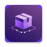
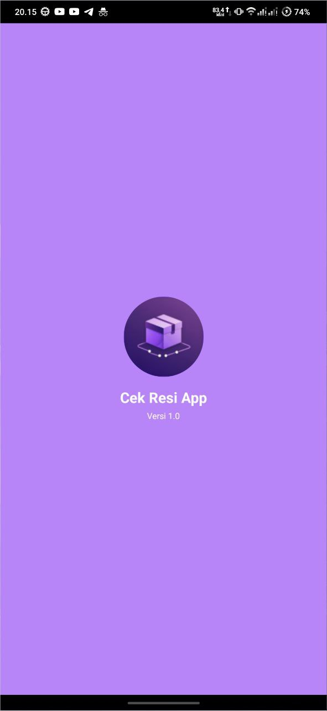
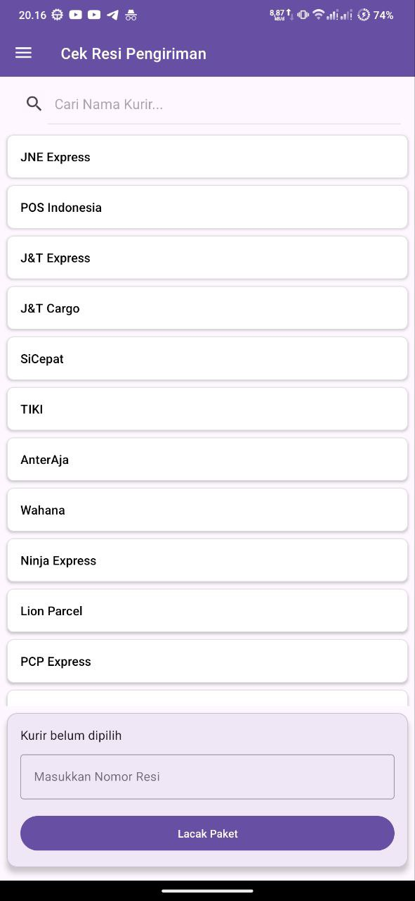
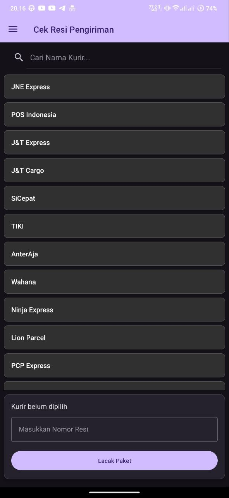
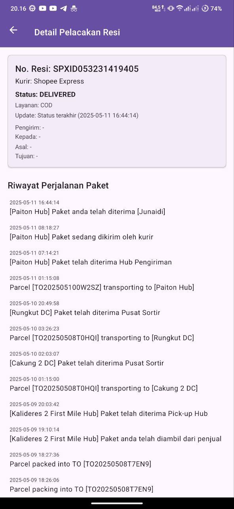
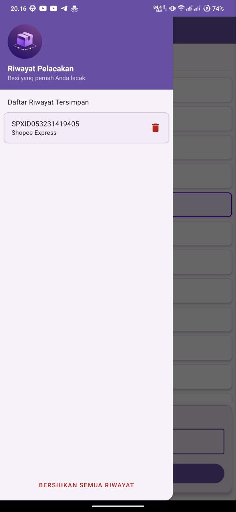
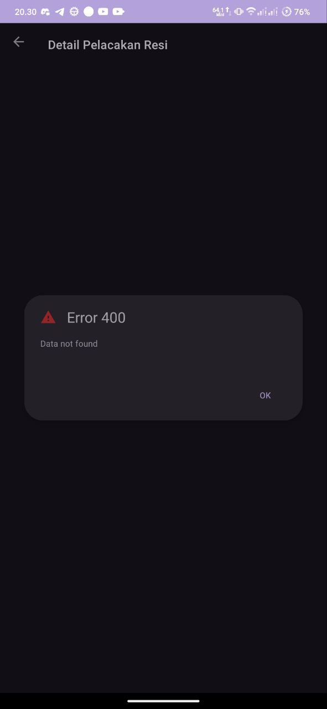
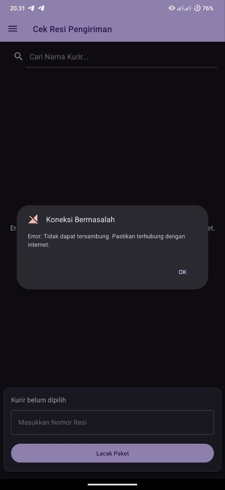

# Cek Resi App - Aplikasi Pelacak Kiriman Paket Anda 📦✨

<p align="center">
  
</p>

Selamat datang di **Cek Resi App**! Aplikasi Android sederhana namun powerful untuk melacak status pengiriman paket Anda dari berbagai kurir di Indonesia dengan mudah dan cepat. Proyek ini dibuat sebagai bagian dari Ujian Tengah Semester (UTS) mata kuliah Pemrograman Mobile Android.

## 📜 Deskripsi Singkat

Cek Resi App memungkinkan pengguna untuk:
* Melihat daftar kurir yang didukung.
* Mencari dan memilih kurir dengan mudah.
* Memasukkan nomor resi (AWB) untuk dilacak.
* Melihat detail status pengiriman dan riwayat perjalanan paket.
* Menyimpan riwayat pelacakan untuk akses cepat di kemudian hari.
* Menikmati tampilan yang konsisten dengan dukungan mode terang dan gelap.

Aplikasi ini dibangun menggunakan Kotlin dan memanfaatkan API eksternal untuk mendapatkan data pelacakan.

## ✨ Fitur Utama

* **Splash Screen**: Tampilan pembuka aplikasi yang menarik dengan logo.
* **Daftar Kurir Dinamis**: Menampilkan daftar kurir yang didukung, diambil dari API.
    * Fitur **Refresh** untuk memperbarui daftar kurir.
* **Pencarian & Filter Kurir**: Memudahkan pengguna menemukan kurir yang diinginkan dari daftar.
* **Pemilihan Kurir Interaktif**: Item kurir yang dipilih akan diberi warna pembeda (selaras dengan tema ungu aplikasi).
* **Pelacakan Resi**: Input nomor resi dan pemilihan kurir untuk memulai pelacakan.
    * Feedback visual (loading state) pada tombol "Lacak Paket".
* **Halaman Detail Pelacakan**:
    * Menampilkan informasi ringkasan paket (No. Resi, Kurir, Status Terakhir, Layanan, Deskripsi Update).
    * Menampilkan detail pengirim, penerima, asal, dan tujuan (jika tersedia dari API).
    * Menampilkan riwayat perjalanan paket dalam daftar yang mudah dibaca.
* **Riwayat Pelacakan (Bookmark)**:
    * Disimpan secara lokal dan ditampilkan di Navigation Drawer (sidebar).
    * Item baru otomatis ditambahkan ke riwayat setelah pelacakan berhasil.
    * Klik pada item riwayat untuk langsung melihat detail pelacakan resi tersebut.
    * Opsi untuk menghapus item riwayat satu per satu (dengan dialog konfirmasi).
    * Opsi untuk membersihkan semua riwayat (dengan dialog konfirmasi).
    * Tampilan "Empty State" jika riwayat kosong.
* **Penanganan Error Informatif**:
    * Dialog popup saat gagal mengambil daftar kurir (misalnya, masalah koneksi internet).
    * Dialog popup saat nomor resi tidak ditemukan, salah, atau sudah kedaluwarsa.
* **Dukungan Mode Gelap (Dark Mode)**: Tampilan aplikasi (termasuk item daftar) beradaptasi secara otomatis dengan pengaturan mode terang/gelap sistem device.
* **User Interface (UI) Responsif**: Didesain agar nyaman digunakan di berbagai ukuran layar.
* **Logo Aplikasi**: Logo kustom yang merepresentasikan fungsi aplikasi.

## 📸 Tangkapan Layar (Screenshots)

<!--
<p align="center">
  
  
  
  
  
  
  


</p>
-->
* *(Placeholder: Screenshot Splash Screen)*
* *(Placeholder: Screenshot Halaman Utama - Daftar Kurir & Input Resi - Mode Terang)*
* *(Placeholder: Screenshot Halaman Utama - Daftar Kurir & Input Resi - Mode Gelap)*
* *(Placeholder: Screenshot Halaman Detail Pelacakan)*
* *(Placeholder: Screenshot Sidebar Riwayat Pelacakan)*
* *(Placeholder: Screenshot Dialog Error)*

## 🛠️ Teknologi & Library yang Digunakan

* **Bahasa Pemrograman**: Kotlin
* **Arsitektur UI**: XML Layouts dengan View (Material Components)
* **Networking**:
    * Retrofit 2: Untuk melakukan panggilan HTTP ke API.
    * OkHttp 3 (Logging Interceptor): Untuk debugging request/response jaringan.
* **Parsing JSON**:
    * Gson: Untuk mengkonversi data JSON dari API menjadi objek Kotlin dan sebaliknya (digunakan oleh Retrofit dan untuk penyimpanan riwayat).
* **Asynchronous Programming**:
    * Kotlin Coroutines: Untuk menjalankan operasi jaringan dan tugas latar belakang lainnya tanpa memblokir UI thread.
    * `lifecycleScope`: Coroutine scope yang terikat dengan lifecycle Activity.
* **Komponen UI Android Jetpack & Material Design**:
    * `androidx.appcompat.app.AppCompatActivity`
    * `com.google.android.material.appbar.MaterialToolbar`
    * `androidx.constraintlayout.widget.ConstraintLayout`
    * `androidx.drawerlayout.widget.DrawerLayout`
    * `com.google.android.material.navigation.NavigationView`
    * `androidx.recyclerview.widget.RecyclerView`
    * `androidx.appcompat.widget.SearchView`
    * `com.google.android.material.card.MaterialCardView`
    * `com.google.android.material.textfield.TextInputLayout` & `TextInputEditText`
    * `com.google.android.material.button.Button`
    * `androidx.swiperefreshlayout.widget.SwipeRefreshLayout`
    * `com.google.android.material.dialog.MaterialAlertDialogBuilder`
    * `android.widget.Toast`
* **Penyimpanan Lokal**:
    * SharedPreferences: Digunakan untuk menyimpan daftar riwayat pelacakan.
* **Build System**: Gradle

## 🌐 API yang Digunakan

Aplikasi ini menggunakan API publik dari **BinderByte** untuk mendapatkan informasi pelacakan resi dan daftar kurir.

* **Dokumentasi API**: [https://docs.binderbyte.com/](https://docs.binderbyte.com/)
* **Endpoint Utama yang Digunakan**:
    * `GET /v1/list_courier`: Untuk mendapatkan daftar kurir yang didukung.
        * Parameter: `api_key` (meskipun observasi menunjukkan endpoint ini bisa diakses tanpa key untuk daftar kurir).
    * `GET /v1/track`: Untuk melacak resi.
        * Parameter: `api_key`, `courier` (kode kurir), `awb` (nomor resi).

## 📥 Unduh Aplikasi

Anda dapat mengunduh versi terbaru aplikasi Cek Resi langsung dari halaman rilis kami di GitHub:

* **[Unduh Cek Resi App v1.0 (APK)](https://github.com/efzynx/cek-resi-app/releases/download/Releases/Cek_Resi_App-v1.0-release.apk])**

Jika terjadi strict, pastikan Anda telah mengizinkan instalasi dari "Sumber Tidak Dikenal" atau "Install unknown apps" di pengaturan device Android Anda sebelum menginstal APK.


## 🚀 Setup & Menjalankan Proyek

Untuk menjalankan proyek ini di Android Studio:

1.  **Clone Repositori**:
    ```bash
    git clone [https://github.com/efzynx/cek-resi-app.git](https://github.com/efzynx/cek-resi-app.git)
    cd cek-resi-app
    ```

2.  **Dapatkan API Key BinderByte**:
    * Kunjungi [website BinderByte](https://binderbyte.com/) dan daftar untuk mendapatkan API key Anda.

3.  **Konfigurasi API Key**:
    * Buat file bernama `gradle.properties` di direktori root proyek Anda (jika belum ada).
    * Tambahkan baris berikut ke dalam file `gradle.properties` tersebut, ganti `MASUKKAN_API_KEY_ANDA_DISINI` dengan API key BinderByte yang Anda dapatkan:
        ```properties
        BINDERBYTE_API_KEY="MASUKKAN_API_KEY_ANDA_DISINI"
        ```
    * **Penting**: File `gradle.properties` ini sudah termasuk dalam `.gitignore` dan tidak boleh di-commit ke repositori jika berisi API key asli.

4.  **Buka Proyek di Android Studio**:
    * Pilih "Open an existing Android Studio project" dan arahkan ke folder proyek yang sudah di-clone.

5.  **Sync Project with Gradle Files**:
    * Tunggu hingga Android Studio selesai melakukan sinkronisasi Gradle. Jika diminta, klik "Sync Now".

6.  **Build dan Jalankan Aplikasi**:
    * Pilih device atau emulator target Anda.
    * Klik tombol "Run 'app'" (ikon play hijau).

## 📁 Struktur Proyek (Gambaran Umum)

Proyek ini mengikuti struktur standar aplikasi Android dengan pemisahan berdasarkan fungsi:

* `com.efzyn.cekresiapp`
    * `adapters`: Berisi kelas-kelas Adapter untuk RecyclerView (`CourierAdapter`, `HistoryAdapter`), `TrackingHistoryAdapter.kt` (adapter untuk riwayat di detail).
    * `model`: Berisi kelas-kelas data (data classes) yang merepresentasikan objek dari API dan data lokal (`Courier.kt`, `TrackingResponse.kt`, `HistoryItem.kt`).
    * `network`: Mengelola konfigurasi Retrofit dan definisi endpoint API (`BinderByteApiService.kt`, `RetrofitClient.kt`).
    * `ui`: Berisi Activity dan logika UI.
        * `main`: `MainActivity.kt` (layar utama, daftar kurir, input resi, drawer riwayat).
        * `splash`: `SplashScreenActivity.kt` (layar pembuka).
        * `tracking`: `TrackingDetailsActivity.kt` (layar detail pelacakan).
    * `utils`: Berisi kelas utilitas seperti `HistoryManager.kt` untuk mengelola penyimpanan riwayat.
* `res/layout`: Berisi file XML untuk semua layout layar dan item.
* `res/values`: Berisi resource seperti string, warna, dimensi, dan tema (termasuk `values-night` untuk dark mode).
* `res/drawable`: Berisi aset gambar dan ikon.

## 🧑‍💻 Pembuat / Kontributor

* **[Ahmad Fauzan Adiman]** - [2221400175]
    * GitHub: `[@efzynx]`
    * Email: `[me@efzyn.my.id]`

* **[Zainullah Multazam]** - [2221400064]
    * GitHub: `[@zainullahmultazam]`
    * Email: `[zinononk04@gmail.com]`


## 📝 Lisensi

Proyek ini dibuat untuk tujuan akademik (UTS). Jika Anda ingin menggunakan atau memodifikasi kode ini, silakan merujuk pada lisensi yang berlaku (jika ada) atau hubungi pembuat.

---

Terima kasih telah mengunjungi repositori ini!
